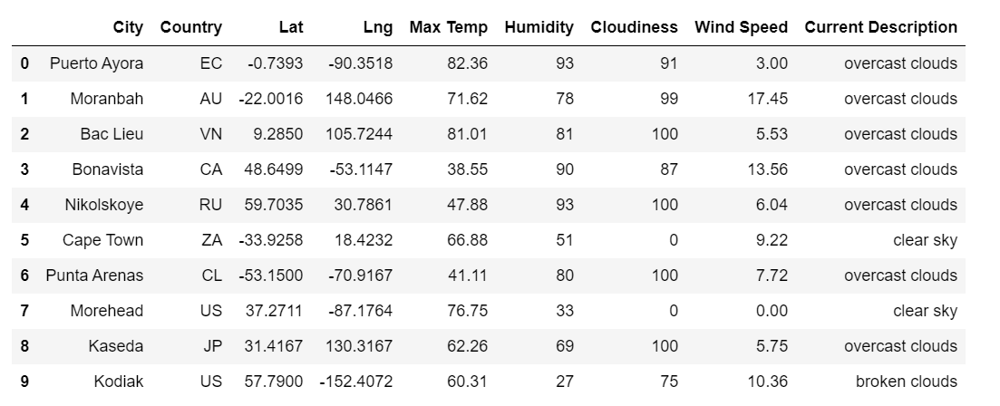
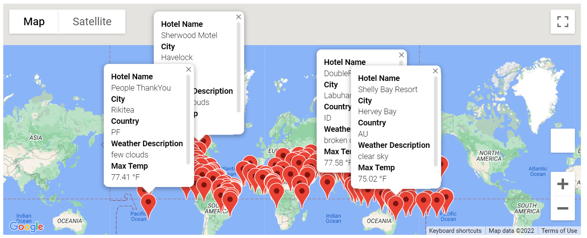
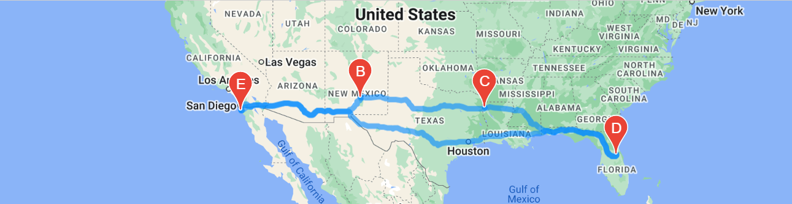
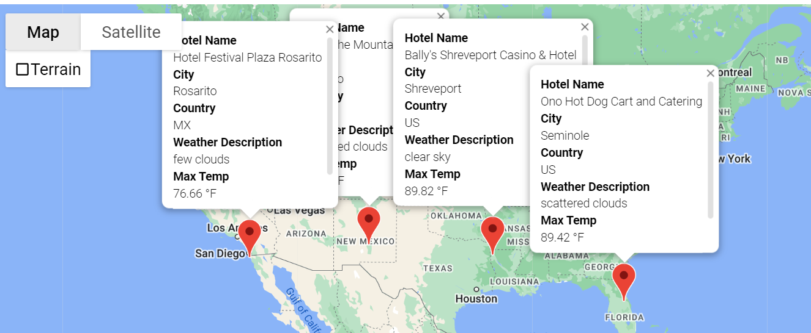

# World Weather Analysis
## Overview
Analysis of different weather patterns across the global to offer insight to travelers looking to plan a multicity trip.

## Weather Database
Using Open Weather Map API to pull weather information for over 700 cities around the world.
We analyzed these cities based on below key factors
  1. Maximum/Minimum Temperatures
  2. HUmidity
  3. Cloudiness
  4. Wind Speed
  5. Current Weather Description

Using these characteristics, customers can easy navigate to cities fitting their desired criteria.

## Vacation Search
Here we used our weather database analysis to find hotels matching our desired weather criteria.
Below are cities with maxium temperature 90 and minimum temperature 75.

## Vacation Itinerary
Now that we have gathered the cities of interest, we have mapped out a desired road trip.
Image below outlines a cross country US road trip starting in California and ending in Florida as well as corresponding available lodging locations.

## Challeneges throughout Analysis
Given our weather criteria of weather between 75-90 degrees farenheit, our client was originally interested in visiting the Hawaiian Islands. 
Unfortunately, we were unable to use anaylsis to map a travel route for our client as the locations are not driveable from one another.
With the limiting options of travel being walking, driving or cycling, our client had to adjust their plans and stay in the continental US.
